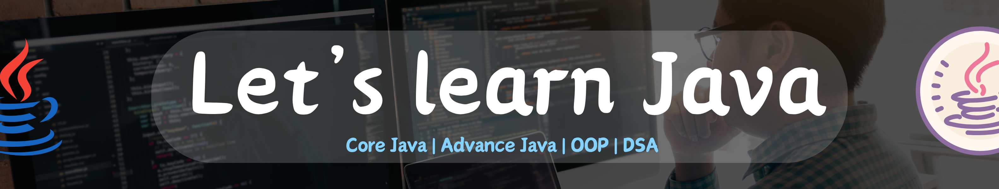

## Programming Fundamentals

(Need to have a solid understanding of one of these Programming Languages)

#### C/C++/Java/Python

- Input/Output
- If/Else
- Loop (Simple Loop, Nested loop)
- Primitive Data Types
- Functions

=> Knowing Mod(%) operators and its use

=> Pattern Printing practice

## Data Structures & Algorithms
